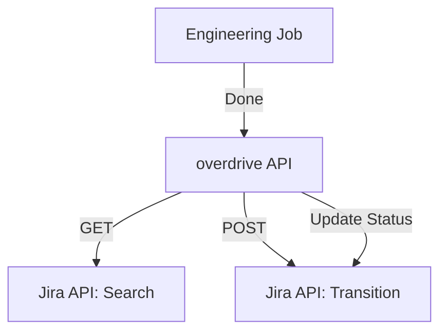

# Jira Integration

overdrive supports real-time synchronization with Jira to manage tasks and engineering workflows.

## Configuration

Jira integration is configured per-project in the **Project Settings** (or through the API).

- **Instance URL**: The base URL of your Atlassian Cloud instance (e.g., `https://company.atlassian.net`).
- **Project Key**: The uppercase key for the Jira project (e.g., `PROJ`).
- **Account Email**: The email address used for API authentication.
- **API Token**: A Jira API token. For security, this can be specified as an environment variable (e.g., `$JIRA_TOKEN`).
- **Status Mapping**:
    - **Pick up**: The Jira status that corresponds to "In Progress" in overdrive.
    - **Done**: The Jira status that corresponds to "Completed" in overdrive.

## Technical Implementation

### Fetching Issues

The API server fetches issues using the Jira Cloud REST API (`/rest/api/3/search`).

- **JQL Query**: `project=<KEY>&maxResults=100`
- **Caching**: Jira issues are cached in-memory for 1 minute to reduce API load.
- **Hierarchical Mapping**: overdrive reconstructs parent-child relationships (e.g., Epics and Stories) based on the `parent` field in Jira issues.

### Status Synchronization

When an engineering job associated with a Jira issue completes, overdrive automatically updates the issue's status in Jira.

1. **Transition Identification**: The server first fetches available transitions for the issue (`/rest/api/3/issue/<KEY>/transitions`).
2. **Matching**: It finds a transition that matches the mapped "Done" status name.
3. **Execution**: It performs the transition via a POST request to the transitions endpoint.

### Real-time UI

The `/todos` page in overdrive uses HTMX to provide a seamless experience when Jira is enabled. Actions like "starting" a task or "starring" (local only) are reflected instantly.

## Architecture

Note: Jira integration requires the `Todo Provider` to be set to `jira` in the project configuration.
